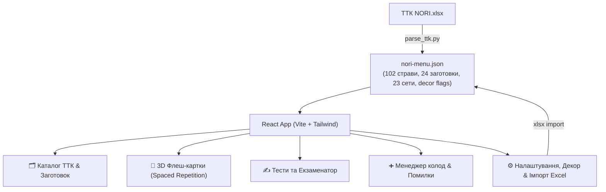

# План реалізації: Веб-додаток тренажера ТТК NORI (NORI TTK Trainer)

> **For agentic workers:** REQUIRED SUB-SKILL: Use superpowers:subagent-driven-development (recommended) or superpowers:executing-plans to implement this plan task-by-task. Steps use checkbox (`- [ ]`) syntax for tracking.

**Goal:** Створити автономний PWA веб-додаток на React + Vite + Tailwind CSS для ефективного вивчення техніко-технологічних карт (ТТК) мережі "NORI", з режимом 3D флеш-карток, інтерактивними тестами, розумним відключенням декору (за кольором клітинок `#E7F9EF`) та каталогом рецептур.

**Architecture:** Клієнтський односторінковий PWA-додаток (React 18 + TypeScript + Vite + Tailwind CSS), у який вшита структурована база JSON, скомпільована безпосередньо з `ТТК NORI.xlsx`. Стан вивчення карток, власні колоди та історія тестів зберігаються в `localStorage`. Підтримується імпорт нового Excel файлу клієнтською бібліотекою `xlsx`.

**Tech Stack:** React 18, TypeScript, Vite, Tailwind CSS, Lucide Icons, Canvas-Confetti, openpyxl / SheetJS (xlsx), Vitest.

---

## Proposed Changes & Tasks

---

### Task 1: Парсинг та підготовка даних меню з Excel

**Files:**
- Create: `scripts/parse_ttk.py`
- Create: `src/data/nori-menu.json`
- Test: `tests/data_validation.test.ts`

- [ ] **Крок 1: Написати скрипт парсингу `scripts/parse_ttk.py`**
  Скрипт зчитує аркуші `ТТК NORI.xlsx`:
  - Розпізнає заливку клітинки `#E7F9EF` та виставляє `isDecor: true`.
  - Зчитує 14 категорій, страви, грамовки, заготовки з технологією та набори.
  - Генерує валідний файл `src/data/nori-menu.json`.

- [ ] **Крок 2: Запустити парсер та перевірити згенерований JSON**
  Команда: `python3 scripts/parse_ttk.py`
  Очікуваний результат: `src/data/nori-menu.json` створено, містить 102 страви, 24 заготовки, 23 сети та ~79 інгредієнтів із `isDecor: true`.

- [ ] **Крок 3: Написати та запустити валідаційний тест структури даних**
  Перевірити, що всі страви мають назву, інгредієнти, коректні грамовки, і декор коректно промаркований.

---

### Task 2: Ініціалізація проєкту Vite + React + TypeScript + Tailwind CSS

**Files:**
- Create: `package.json`, `vite.config.ts`, `tailwind.config.js`, `postcss.config.js`, `index.html`
- Create: `src/index.css`, `src/main.tsx`, `src/App.tsx`

- [ ] **Крок 1: Ініціалізувати Vite-проєкт та встановити залежності**
  Залежності: `lucide-react`, `canvas-confetti`, `@types/canvas-confetti`, `xlsx`, `clsx`, `tailwind-merge`.
  Dev-залежності: `tailwindcss`, `autoprefixer`, `postcss`, `vitest`.

- [ ] **Крок 2: Налаштувати Tailwind CSS з підтримкою 3D-трансформацій карток**
  Додати утиліти `perspective-1000`, `transform-style-3d`, `backface-hidden`, `rotate-y-180`.

- [ ] **Крок 3: Перевірити збірку базового додатку**
  Команда: `npm run build`
  Очікуваний результат: успішна збірка без помилок.

---

### Task 3: Моделі типів, LocalStorage та контекст стану (AppContext)

**Files:**
- Create: `src/types/ttk.ts`
- Create: `src/services/storage.ts`
- Create: `src/context/AppContext.tsx`

- [ ] **Крок 1: Створити інтерфейси `src/types/ttk.ts`**
  Описати типи `Ingredient`, `Dish`, `PrepTech`, `SetMenu`, `FlashcardProgress`, `CustomDeck`, `ExamResult`.

- [ ] **Крок 2: Реалізувати сервіс локального сховища `src/services/storage.ts`**
  Збереження та читання:
  - Статуси вивчення карток (`mastered`, `learning`, `timesReviewed`).
  - Користувацькі колоди (`customDecks`).
  - Налаштування декору (`ignoreDecor: boolean`, список додаткового декору).
  - Експорт/імпорт резервної копії (JSON).

- [ ] **Крок 3: Реалізувати React Context `AppContext.tsx`**
  Забезпечує доступ до меню, перемикача декору, списку активних карток, додавання страв у колоди.

---

### Task 4: Інтерактивний каталог ТТК (Довідник рецептур)

**Files:**
- Create: `src/components/Catalog/CatalogView.tsx`
- Create: `src/components/Catalog/DishCard.tsx`
- Create: `src/components/Catalog/PrepCard.tsx`
- Create: `src/components/Catalog/SetCard.tsx`

- [ ] **Крок 1: Створити компонент `DishCard.tsx`**
  Відображення ролу: назва, категорія, вихід ваги. Чітке розмежування:
  - «Основний склад» (рис, норі, риба, сир, овочі).
  - «Декор та поливи» (з бейджем `🌿 Декор`). При увімкненому «Без декору» декор ховається або згортається.
  - Кнопка «⭐ Додати до колоди».

- [ ] **Крок 2: Створити компоненти `PrepCard.tsx` (Заготовки) та `SetCard.tsx` (Набори)**
  Для заготовок: покроковий техпроцес приготування (варіння рису, соуси) та терміни зберігання.

- [ ] **Крок 3: Створити `CatalogView.tsx` з пошуком та фільтрацією**
  Миттєвий пошук за назвою або інгредієнтом + горизонтальні кнопки категорій.

---

### Task 5: Тренажер 3D флеш-карток (Інтервальне повторення)

**Files:**
- Create: `src/components/Flashcards/FlashcardView.tsx`
- Create: `src/components/Flashcards/FlashcardItem.tsx`
- Create: `src/components/Flashcards/DeckSelector.tsx`

- [ ] **Крок 1: Реалізувати компонент картки `FlashcardItem.tsx`**
  - Лицьовий бік: категорія, назва ролу, вага.
  - 3D-переворот по кліку або пробілу.
  - Зворотний бік: основні інгредієнти та точні грамовки (декор відфільтровується, якщо активний режим «Без декору»).
  - Кнопки: 🔴 «Повторити» / 🟢 «Знаю».

- [ ] **Крок 2: Реалізувати логіку навчальної сесії в `FlashcardView.tsx`**
  - Підтримка раундів (10-20 карток).
  - Картки, позначені як "Повторити", повертаються наприкінці сесії, поки не будуть засвоєні.
  - Прогрес-бар поточної сесії + анімація завершення (confetti).

- [ ] **Крок 3: Додати вибір колод `DeckSelector.tsx`**
  Вибір за категоріями, «Всі страви», «Заготовки», «Робота над помилками», власні колоди.

---

### Task 6: Модуль тестування та Екзамен (Quiz)

**Files:**
- Create: `src/components/Exam/ExamView.tsx`
- Create: `src/components/Exam/QuestionCard.tsx`
- Create: `src/components/Exam/ExamResults.tsx`
- Create: `src/services/quizGenerator.ts`

- [ ] **Крок 1: Написати генератор запитань `quizGenerator.ts`**
  - Запитання на склад: вибір правильних складників ролу (з оманливими варіантами).
  - Запитання на грамовку: скільки грамів інгредієнта потрібно.
  - Фільтрація: якщо `ignoreDecor` увімкнено, декор не бере участь у тестах.

- [ ] **Крок 2: Реалізувати інтерактивний екран проходження тесту `QuestionCard.tsx`**
  Таймер / лічильник запитань, миттєвий візуальний фідбек (зелений/червоний).

- [ ] **Крок 3: Реалізувати екран підсумків `ExamResults.tsx`**
  - % успішності та оцінка.
  - Детальний список помилок.
  - Кнопка **«Створити колоду з моїх помилок»** (зберігає помилкові страви в окрему колоду для вивчення).

---

### Task 7: Менеджер колод, Налаштування та Імпорт Excel

**Files:**
- Create: `src/components/Decks/DecksManager.tsx`
- Create: `src/components/Settings/SettingsView.tsx`
- Create: `src/services/excelImporter.ts`

- [ ] **Крок 1: Реалізувати менеджер колод `DecksManager.tsx`**
  Створення, редагування, вибір страв для колоди, видалення.

- [ ] **Крок 2: Реалізувати налаштування та клієнтський імпорт Excel `excelImporter.ts`**
  - Завантаження файлу `.xlsx` через браузер через `xlsx` (SheetJS).
  - Налаштування списку декору.
  - Експорт/імпорт бекапу прогресу у файл.

---

### Task 8: Головний лейаут, PWA маніфест, стилізація та фінальна верифікація

**Files:**
- Create: `src/components/Layout/Header.tsx`
- Create: `src/components/Layout/BottomNav.tsx`
- Create: `public/manifest.json`
- Modify: `src/App.tsx`, `index.html`

- [ ] **Крок 1: Створити хедер та мобільну навігацію**
  - Тогл **«🌿 Без декору»** у шапці (завжди під рукою).
  - Перемикання вкладок: Каталог / Картки / Тести / Колоди / Налаштування.
  - Перемикач теми (темна / світла).

- [ ] **Крок 2: Додати PWA маніфест та іконки**
  Можливість встановити як додаток на головний екран смартфона.

- [ ] **Крок 3: Повна перевірка збірки та тестів**
  - `npm run test`
  - `npm run build`
  - Запуск локального прев'ю `npm run preview`.
